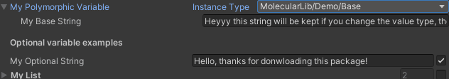
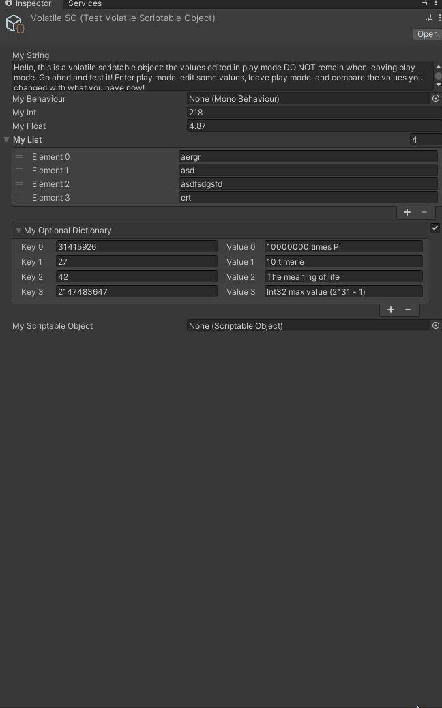
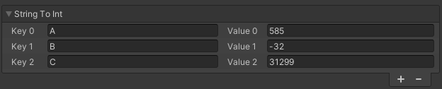
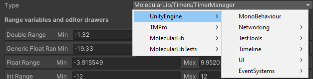
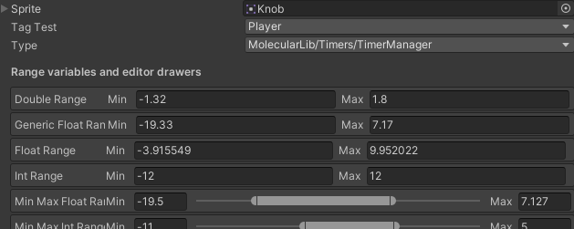

# MolecularLibCore · [](https://github.com/Heymity/MolecularLibCore/blob/master/LICENSE) [](https://unity3d.com/get-unity/download/archive)  


This is a package for unity that provide useful utilities like the  PolymorphicVariable and SerializableDictionary<TKey, TBase>  classes and editor drawers, the ability to instantiate GameObjects with passing parameters to it, a safe Tag wrapper class, support for optional fields, a VolatileScriptableObject class and more!

## How to download it

The asset is available in the [Unity Asset Store](https://u3d.as/2PCg) where it can be easily downloaded and installed like any other unity package. Otherwise you can just download this repository and add it to your project. 

## What does it have?

  - [PolymorphicVariable&lt;T&gt;](#polymorphicvariablet)
  - [VolatileScriptableObject&lt;T&gt;](#volatilescriptableobjectt)
  - [SerializableDictionary&lt;TKey, TValue&gt;](#serializabledictionarytkey-tvalue)
  - [Timers](#timers)
  - [AutoSingleton](#autosingleton)
  - [Instantiate with args](#instantiate-with-args)
  - [Vector helper methods](#vector-helper-methods)
  - [Color helper methods](#color-helper-methods)
  - [String helper methods](#string-helper-methods)
  - [Optional&lt;T&gt;](#optionalt)
  - [Ranges](#ranges)
  - [Tag wrapper](#tag-wrapper)
  - [TypeVariable](#typevariable)
  - [PlayStatus](#playstatus)
  - [Maths](#maths)
  - [TypeLibrary](#typelibrary)
  - [EditorHelper](#editorhelper)
  - [Enhanced Sprite Editor Drawer](#enhanced-sprite-editor-drawer)

## Contents

Here is a quick overview of the contents of this package, for more details check the documentation present in "Assets/HandsomeDinosaur/MolecularLib/Core/MolecularLib Docs.pdf or .docx":

### PolymorphicVariable&lt;T&gt;

The Polymorphic Variable adds support for polymorphism in unity serializable fields. If you don’t know what polymorphism is, I strongly suggest reading [this](https://www.w3schools.com/cs/cs_polymorphism.php) page (It is very short, mostly examples). 

You can access this value as TBase using myPolymorphicVar.Value or you can get it already converted using myPolymorphicVar.As<TDerived>(out TDerived, bool onlyPerfectTypeMatch) like this:

```c#
myPolymorphicVar.Value // returns the value as TBase

if (myPolymorphicVariable.As<A>(out var asA))
    Debug.Log($"As A | aClassInt: {asA.aClassInt}");
else if (myPolymorphicVariable.As<B>(out var asB))
    Debug.Log($"As B | bClassInt: {asB.bClassInt}");
else if (myPolymorphicVariable.As<C>(out var asC))
    Debug.Log($"As C | cClassFloat: {asC.cClassFloat}");
else
    Debug.Log($"As Base | myBaseString: {myPolymorphicVariable.Value.myBaseString}");
```

### VolatileScriptableObject&lt;T&gt;



As you probably know, scriptable objects in Unity have persistent data for entering and leaving play mode, so if you have an int in a scriptable object set to 100, and then, while in play mode, you change it to 50, when you exit play mode, it will still be 50, not 100.  This is sometimes good and sometimes bad. One of these bad times is when you’re using scriptable objects to hold changeable data, say player health. You would want the player's health to be reset when you leave play mode, but you also want to change it during play mode. If you are thinking this is a very strange way to code a game by the way, check [this](https://www.youtube.com/watch?v=raQ3iHhE_Kk), it has some very good benefits. So, what the VolatileScriptableObject class does is that it solves this problem! You can change the data in it, and when you leave play mode it won’t be changed.

There is a very good demo and implementation of this here “Demo > TestVolatileScriptableObject.cs”. But if you want a quick sneak-pic of it, here it is:
```c#
[CreateAssetMenu(fileName = "Volatile SO", menuName = "New Volatile SO", order = 0)]
public class TestVolatileScriptableObject : VolatileScriptableObject<TestVolatileScriptableObject.Data>
{
    // Here is a quick way of accessing the data. Can be done in other ways too.
    public Data VolatileData
    {
        get => Value;
        set => Value = value;
    }
    
    // Here you will put all the data you want to be volatile
    [Serializable]
    public class Data
    { 
        [TextArea] public string myString;
        public MonoBehaviour myBehaviour;
        public int myInt;
        public float myFloat;
        public List<string> myList;
        public Optional<SerializableDictionary<int, string>> myOptionalDictionary;
        public ScriptableObject myScriptableObject;
    } 
}
```

### SerializableDictionary&lt;TKey, TValue&gt;


As it is commonly known, unity serializes Lists, but not Dictionaries. But what is a serialized dictionary if not 2 lists, one for the keys, and one for the values? That’s exactly what the SerializableDictionary<TKey, TValue> does! Right before Unity serializes the class, it converts its dictionary to two lists, keys and values, which are then serialized by Unity. Then just after deserialization, those lists are converted back to a dictionary. It also comes with a neat editor drawer! It will look like this in the inspector (if the variable is public or has [SerializeField]):

### Timers

Well, it is kind of obvious what it does, so let’s jump right into how to use the timers. There 		are two types of timers in the library:
		
•	Timer Async
•	Timer Coroutine

And the timer Async can generate a TimerReference class.

Both types of timers have the same functionalities:
•	OnComplete / OnFinish
•	Duration
•	ElapsedSeconds
•	Repeat

The main difference between Timer Async and Timer Coroutine is the way they work:
Timer Async, as the name suggests, uses an asynchronous function to count the time using Task.Delay(secondsToFinish) and the ElapsedSeconds are calculated via UnityEngine.Time.time – Timer.StartTime (Timer.StartTime is set to UnityEngine.Time.time when the timer starts).

Now the Timer Coroutine uses a coroutine to count time, using yield return new WaitForSeconds(delay), and the ElapsedSeconds are also calculated via UnityEngine.Time.time – Timer.StartTime (Timer.StartTime is set to UnityEngine.Time.time when the timer starts).

Aside from how they work, TimerCoroutine will instantiate 1, and only one through the entire program execution, GameObject with the TimerManager script (It has a singleton by the way). While the Async timer will not. The Timer Async CANNOT be paused or resumed, can only be permanently stopped in repeat mode. The Timer Coroutine CAN be paused and resumed, even in repeat mode.

The way I suggest looking at this is like so: The Async timer is a lightweight more basic version of the TimerCoroutine. If you just need a timer, real quick for some real basic stuff, use the Async, if you need it to be more controllable, use the Coroutine.

```c#
Timer.TimerAsync(TimerDelay, () => Debug.Log("Finished”));
    
   
var timerReference = Timer.TimerAsyncReference(TimerDelay);
    
timerReference.OnFinish += () => Debug.Log("Finished");
if (timerReference.HasFinished) Debug.Log("Already finished");
Debug.Log($"There has elapsed {timerReference.ElapsedSeconds} seconds");

var timer = Timer.Create(TimerDelay, () => Debug.Log("Finished"));
    
// Repeat timer
var timer = Timer.Create(TimerDelay, () => Debug.Log("Finished"), true);
```

### AutoSingleton

Need to use a singleton but don’t want to write the same stuff every time? Just do this:
In your MonoBehaviour class, change the parent class from MonoBehaviour to AutoSingleton<YOUR TYPE HERE>, so that it looks like this:

```c#
public class TimerManager : AutoSingleton<TimerManager>
```

Using it this way, from anywhere in the code you will be able to access TimerManager.Current and get a TimerManager instance!

Note: AutoSingleton<T> derives from MonoBehaviour

#### How does it get the instance?

In some ways: First, before you call Current for the first time, it has no idea where is this instance. When you call it the first time it will do the following:


### Instantiate with args

First off to use this, the object that you want to instantiate needs to have this interface: IArgsInstantiable<>. There are a total of 10 overrides of this interface, one with no parameters, one with 1 parameter, one with 2 parameters … and one with 10 parameters. The function that this interface implements will as parameters the types passed into the interface, like so:

```c#
public class TestArgInstantiable : MonoBehaviour, IArgsInstantiable<float, int, string, GameObject>
{
    public float floatArg;
    public int intArg;
    public string stringArg;
    public GameObject gameObjectArg;
    
    public void Initialize(float arg1, int arg2, string arg3, GameObject arg4)
    {
        Debug.Log(
	$"I was instantiated with args: args1: {arg1} args2: {arg2} args3: {arg3} args4: {arg4}");
        floatArg = arg1;
        intArg = arg2;
        stringArg = arg3;
        gameObjectArg = arg4;
    }
}
```

This function “Initialize” will then be called just after the awake and after the object is instantiated. To instantiate this object, for example, you would do it like this:

```c#
var floatIntStringGo = Molecular.Instantiate(prefab, 23.3f, 342, "I am a string", someGo);
```

It is simple to use and implement it!

In the Demo folder, there is a great example of this called InstantiateWithArgsDemoObject


### Vector helper methods

There are only extension methods, and the class they are contained in is the VectorHelperExtensionMethods. So they are all used like this: myVector.METHOD()

There are methods like
```c#
myVector2.WithX(5);
myVector3.WithX(x => x + 1);
myVector4.WithoutW();
myVector3.IsBetween(minVec3, maxVec3); // min and max not inclusive
myVector2.IsWithin(minVec2, maxVec2); // min and max inclusive
myVec2.ToVector2Int();
myVec3Int.ToVec2();
```

### Color helper methods

The ColorHelper static class provides helper functions for the Color class in Unity. It contains both static methods and extension methods for colors, here are some of them, for the complete list, check the documentation

```c#
ColorHelper.Random();
ColorHelper.FromString("N-hydroxy-N-methylpropanamide");
var textColor = myBackgroundColor.TextForegroundColor();
myColor.WithR(128);
myColor.WithB(0.5f);
myColor.ToHexString();
myColor.FromHexString();
```

### String helper methods

This class offers useful methods for working with rich text strings and some for just normal strings. For example:

```c#
	"Hello World!"
	    .ToBuilder()
	    .Color(UnityEngine.Color.green)
	    .Bold()
	    .Italic()
	    .Size(20)
	    .NewLine()
	    .ToString()
	    .Ellipsis(50, "Label");
```

There are both rich text methods and normal string manipulation methods, the rich text ones have two overloads, one using strings and one with StringBuilder, which is more efficient for calling more than one methods in a chain like in the example above

The non-rich text methods are:
```c#

myString.ToColor()
myString = myString.Ellipsis(50f, guiContent => guiContent.text.Lenght * 2f);
myString = myString.Ellipsis(50f, myGUIStyle);

```

### Optional&lt;T&gt;

This is extremely useful for when you want to have a value that can be optional. In the code it will look like this:

```c#
     [SerializeField] private Optional<string> myOptionalString;
```

In the editor it will look like this:

 

Where you can toggle the right toggle to enable or disable the value.
In code you will access that like this:

```c#
   if (myOptionalString.HasValue)
       Debug.Log(myOptionalString.Value);

   // Or simply (Using implicit operators)

   if (myOptionalString)
       Debug. Log (myOptionalString);
```

### Ranges


These are a collection of helper classes to express ranges (Not the C# 9 indexes ranges [3..4]). These are really useful for expressing a patrol range for some enemy, or a temperature range for a map generator, or a height range for a NPC, etc… 

Moreover, all range classes derive from the master class Range<T> which derives from IRange<T> which derives from IRange where T needs to implement IComparable. So, if you have a class that implements IComparable, it will work with a nice editor and everything in a Range.

The IRange<T> interface contains two properties:
T Min { get; set; }
T Max { get; set; }

The Range interface contains one methods:
ValidateMinMaxValues();

#### Range<T>
The Range<T> class is the master class for all the ones bellow, all that’s valid for this is valid for the following ones.
It contains two properties: 
T Min { get; set; }
T Max { get; set; }

And a set of methods:
•	IsInRange(T value) :bool
•	Clamp(T value) :T
•	ClampCeil(T value) :T
•	ClampFloor(T value) :T
•	ValidateMinMaxValues()

The Range<T> can also be deconstructed as so:
var (min, max) = myRange;
and it also implements implicit operators so you can convert your range to and from a Range.

#### RangeInteger
The Range class inherits from Range<int> and implements some extra useful methods and properties:
•	MidPoint :int

•	Lerp(float t) : int
•	LerpUnclamped(float t) : int
•	InverseLerp(int value) : float
•	InverseLerpUnclamped(int value) : float
•	Random() : int

#### RangeVector
The RangeVector classes (RangeVector2, RangeVector3, RangeVetor2Int, RangeVector3Int) all derive from a tuple, like this: RangeVector2 : Range<(float x, float y)>. Because Vector doesn’t implement IComparable, that is needed. Apart from that, it works normally, as the properties are overridden to return a Vector and not a tuple.

The RangeVector classes implement the following:
•	Lerp(float t) : Vector
•	LerpUnclamped(float t) : Vector
•	InverseLerp(Vector value) : float
•	InverseLerpUnclamped(Vector value) : float
•	Random() : Vector
•	GetBoundingBox() : Bounds

The int version of these vector ranges also implements GetBoundingIntBox() :BoundsInt


### Tag wrapper

This provides a safe tag wrapper that makes it so you don’t need to use string bindings at all while working with tags in Unity! One less point of failure! Just declare as a field in your MonoBehaviour a tag like this: public Tag myTag; and check out the editor. It should look like this:


You can then call 

```c#
   tagTest.CompareTag(gameObject);
   // Or
   gameObject.CompareTag(tagTest);
```

You can also get the tag as a string using the Tag.TagName property
It also offers implicit operators to do the conversion from Tag to string and string to Tag.


### TypeVariable

There are two ways of using the type variable: TypeVariable<Base> and [TypeVariableBaseType(typeof(Base))] TypeVariable. But both of them accomplish the same result: A variable that stores a type in the object:


 

If you go back to the first section of this manual, PolymorphicVariable<Base>, you will see that it uses this in its implementation. In the code, you access the type via the implicit conversion or using TypeVariable.Type.


### PlayStatus

This is the simplest class in this library. When the game scene loads, it sets its IsPlaying property to true. Yes, it does the same as Application.IsPlaying. This class only exists because not always you can call Application.IsPlaying.

### Maths

This is a static class that implements some useful functions involving maths. Here are the functions:

•	Lerp(float a, float b, float t) :float
•	InvLerp(float a, float, b, float value) :float
•	InvLerp(Vector2 a, Vector2, b, Vector2 value) :float
•	InvLerp(Vector3 a, Vector3, b, Vector3 value) :float
•	InvLerpClamped(Vector2 a, Vector2, b, Vector2 value) :float
•	InvLerpClamped(Vector3 a, Vector3, b, Vector3 value) :float
•	Remap(float iMin, float iMax, float oMin, float oMax, float v) :float
•	RemapClamped(float iMin, float iMax, float oMin, float oMax, float v) :float
•	IsAllGreaterThan(Vector3 reference, Vector3 toBeGreater) :bool
•	IsAllGreaterThan(Vector2 reference, Vector2 toBeGreater) :bool
•	IsAllSmallerThan(Vector3 reference, Vector3 toBeGreater) :bool
•	IsAllSmallerThan(Vector2 reference, Vector2 toBeGreater) :bool
•	IsWithin(this float v, float min, float max) :bool
•	IsBetween(this float v, float min, float max) :bool

Lerp stands for Linear interpolation. The Lerp functions here are unclamped, for the clamped ones and the ones for Vectors check UnityEngine.Mathf.Lerp and Vector.Lerp.

The InverseLerp methods do the opposite of the lerp, instead of getting a value that is t% of the way between a and b, it gets the t% value of a given value v between a and b. For a more in-depth explanation of this, check [this](https://youtu.be/NzjF1pdlK7Y?t=539) video by Freya Holmer.

The Remap methods remap a value from the given input range to the output range. It’s useful if you need to change the domain of a value. Say you have a world generator that gives you values from -1 to 1, but you need those to be in the range of 0 to 10, you would use the Remap(-1, 1, 0, 10, value) to get the value between 0 and 10 and not between -1 and 1. For a more in-depth explanation of this, check [this](https://www.youtube.com/watch?v=NzjF1pdlK7Y&t=1762s) video by Freya Holmer.

IsWithin checks if the value is greater or equal and smaller or equal than the min and max respectively. IsBetween checks if the value is greater and smaller than the min and max respectively. The other methods are very self-explanatory.

### TypeLibrary

Well, sometimes it is needed to access all the types that are present in the project (mostly for the next helper topic). To simplify that process and avoid it being done twice or more, the TypeLibrary static class will, after the assemblies are loaded, fetch and cache all the types present in the app domain. If you don’t want to use it, and neither want to use the Type Variable nor the PolymorphicVariable, remove USE_TYPE_LIBRARY from the Scripting Define Symbols in “Project Settings > Player > Script Compilation > Scripting Define Symbols”.

The class provides 3 properties:
•	AllAssembliesTypes { get; } :IEnumerable<Type>
•	AllNonUnityAssembliesTypes { get; } :IEnumerable<Type>
•	AllAssemblies { get; } :IDictionary<string, Assembly>


### EditorHelper

This class offers useful functions for handling editor drawers and custom inspectors. Most of the methods are used internally, but as they still are pretty useful, the class and methods are left as public. The methods can be split up in 3 categories: UIElements; IMGUI; and General Utilities;

For all the methods please check the documentation

### Enhanced Sprite Editor Drawer


In case you don’t like this editor drawer, or want to do your own, just go here “HandsomeDynosaur/MolecularLib/Core/Editor” and inside that folder delete the file “SpriteEditorDrawer.cs”. Just keep in mind that if you update the package the file will come back.
